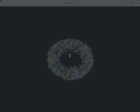
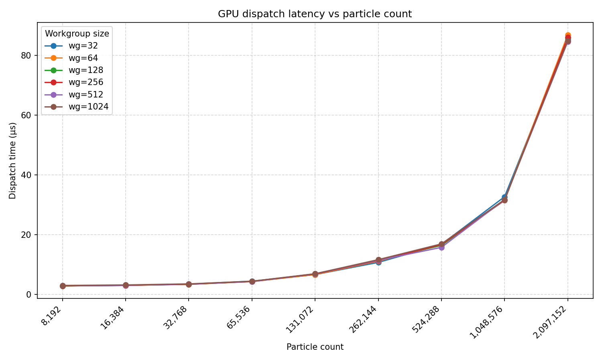
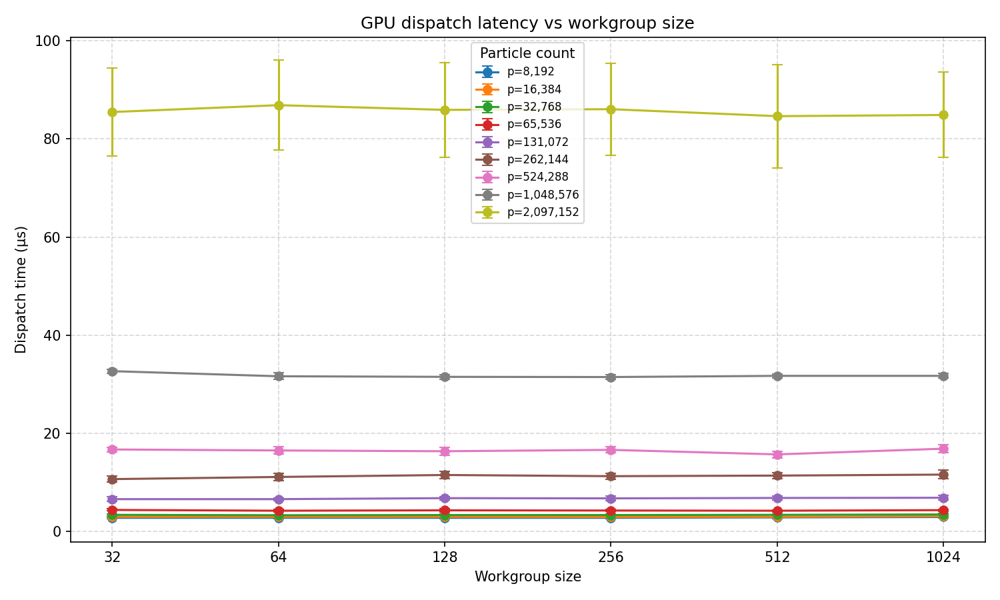
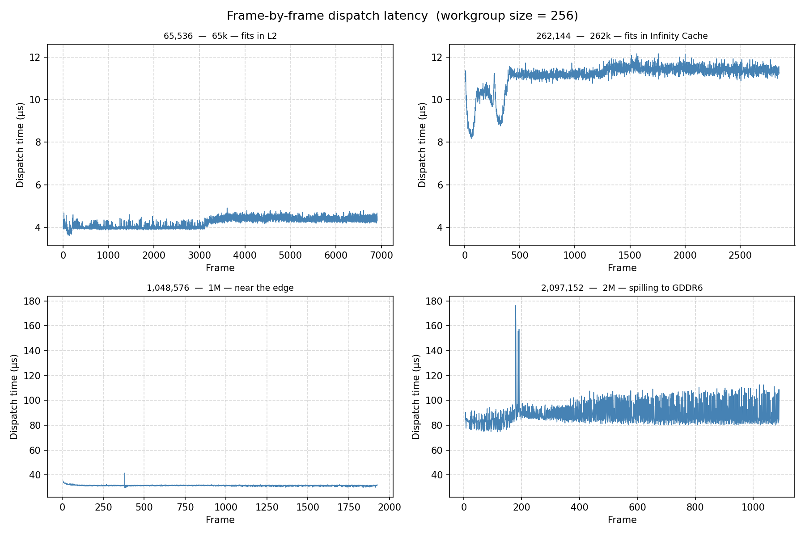

# Vulkan Compute Performance — RDNA3 Workgroup Sweep

<p align="center">
  
</p>

> **Central question:** how does workgroup size and particle count affect GPU compute execution time on RDNA3, and where does memory bandwidth become the bottleneck?

This project uses the Vulkan compute API to run a GPU particle simulation, then sweeps workgroup thread count (32-1k) and particle count (8k – 2M+) while recording precise GPU-side timing via Vulkan timestamp queries. The repo has two goals. First to gain hands on experience with the Vulkan compute pipeline, second is to connect measured execution time numbers back to the architectural specs of the RX 7900 XT.

---

## What the application does

The simulation places particles in a circle, assigns each one a velocity, and bounces them off screen edges. Every frame, a compute shader updates all particle positions on the GPU. A separate graphics pipeline renders them as coloured point sprites.

The compute shader is deliberately minimal:

```
new_position = old_position + velocity * deltaTime
```

One thread computes one particle. There is no inter-thread communication, no shared memory use, and minimal arithmetic. The shader reads 32 bytes and writes 32 bytes per particle. **This makes it a near-pure memory bandwidth test**.

The initial particle buffer is allocated in device-local GPU memory. The CPU uploads initial positions once via a staging buffer, than all updates happen entirely on the GPU with compute shader.

---

<details>
<summary><strong>RDNA3 architecture and theoretical expectations</strong></summary>

### Hardware
https://rocm.docs.amd.com/en/docs-6.3.3/reference/gpu-arch-specs.html

| Property | Value |
|---|---|
| GPU | AMD Radeon RX 7900 XT |
| Architecture | RDNA3 (gfx1100) |
| Compute Units | 84 |
| Wavefront size | 32 threads |
| LDS per WGP | 128 KiB |
| Infinity Cache | 80 MiB |
| L2 Cache | 6 MiB |
| Graphics L1 Cache | 256 KiB |
| L0 Vector Cache | 32 KiB (per CU) |
| GDDR6 bandwidth | up to 800 GB/s |
| Effective bandwidth (with Infinity Cache) | up to 2900 GB/s |
| VRAM | 20 GB |

### Memory traffic per dispatch

Each particle holds:

| Field | Type | Size |
|---|---|---|
| position | float2 | 8 bytes |
| velocity | float2 | 8 bytes |
| color | float4 | 16 bytes |
| **Total** | | **32 bytes** |

The compute shader function uses particle.position and particle.velocity 8+8=16 bytes. It then rewrites this with updated values, therefore the read + write memory operation should take 32 bytes for every particle.

To calculate the theoritical maximum speeds, I calculate amount of bytes in power of 2. The counts are already in power of 2, just need to multiple with 2^5 for the 32 byte traffic:  

| Particle count | Total traffic per frame |
|---|---|
| 65,536 | 2^16 * 2^5 = 2^21|
| 262,144 | 2^18 * 2^5 = 2^23|
| 524,288 | 2^19 * 2^5 = 2^24|
| 1,048,576 | 2^20 * 2^5 = 2^25|
| 2,097,152 | 12^21 * 2^5 = 2^26|
| 4,194,304 | 12^22 * 2^5 = 2^27|

### Infinity Cache and the expected bandwidth

The Infinity Cache is 80 MiB. It is unclear based on my quick research if this is just read or read and write.
Log2(80MiB) = Log2(83 886 080) = 26.32 so the cache can fit more than 2^26 bytes and less than 2^27 bytes.
This means the around 2 Million particles should fit in the Infinity Cache, and we should not see significant drop in speed.
However it is still unclear if this is a read only cache or read and write cache, for example 40MiB for read and 40MiB for write.
Therefore I cannot assume that the read+write whole traffic would fit in this cache, and memory load speed could be mostly hidden with interleaving threads, or with more precise GPU terms "high occupancy".

### Theoretical throughput ceiling

Cache and GDDR6 speeds are given in GB for marketing instead of power of 2 speeds, for easier calculation, first change them to GiB/s:
2900 * (10^9 / 2^30) = 2700
The 2900 GB/s is 2700 GiB/s.
The 800 GB/s is 745 GiB/s.

Lets calculate the ~500k particles expected maximum speed at 2700 GiB/s:
2^24 / 2700 * 2^30 = 1/(2700) * 1/(2^(30-24)) = 1/(2700) * 1/(2^6) = 5,78 µs

Similarly let's see ~4M particles at GDDR6 speed without cache at all so at 745 GiB/s:
1/(745) * 1/(2^3) = 1 / 5960 = 167 µs

### Workgroup size 
The original tutorial uses 
`commandBuffer.dispatch(PARTICLE_COUNT / 256, 1, 1);`
The compute shader declares:
[shader("compute")]
[numthreads(256,1,1)]

This means each work group runs 256 invocations (threads) of the shader.
Therefore if we want 1 invocation for every 1 particle, we need to launch enought work groups to cover all particles.
So workgroups = Particle count / num_of_threads in the shader.

The benchmark here aims to visulize the effect of num_of_threads per workgroups from the API perspective.
On RDNA3 there  are 32 thread slots per wavefront (https://gpuopen.com/learn/occupancy-explained/), so ideally we want and exact multiplier for maximum occupancy. For example if we have 32+32+2 threads, than the third wavefront will be mostly empty, with 32-2=30 empty threads.
One SIMD can interleave multiple wavefronts. 
From the api perspective, what we can be sure of, is that the workgroup will run on a WGP that share a fast shared memory called LDS (Local Data Share - 128KiB), or 'groupshared'. If a workgroup uses a large amount of LDS, fewer workgroups can be resident on the same WGP simultaneously, reducing occupancy.

So on the Vulkan API part we can vary the number of workgroups.
On the shader part we can vary the number of threads per workgroups.
On the GPU one workgroup will run on one WGP, where threads will be organized into wavefronts.

The below graph is my current understanding of execution hierarchy:
```
GPU
└── Shader Engine (SE)
    └── Work Group Processor (WGP)
        └── CU × 2  (a WGP contains 2 CUs)
            └── SIMD × 4  (each CU has 4 SIMDs)
                └── 16 wavefront slots  (each SIMD can hold 16 waves)
```
For expectation I would guess that smaller num_threads (/smaller workgroups) allow the GPU to schedule wavefronts as it pleases, as there is less restriction which wavefronts must run on the same WGP/SIMD so that probably should be a bit faster.
However at larger particle counts, with smaller num_threads, the larger number of workgroups might increase book keeping cost, and could cause slower speeds.
To make much more educated guesses I am aware that there is a special tool for AMD: Radeon GPU Analyser (RGA), but at this point of time I have limited the scope of this project.

</details>

<details>
<summary><strong>Measurement methodology</strong></summary>

### Why not CPU timing?

Wrapping a `vkQueueSubmit` call in `std::chrono` on the CPU measures the wrong thing. The CPU call returns almost immediately — the GPU executes the work asynchronously. Even if you wait for the fence, you are measuring submission overhead, driver processing, fence signalling, and OS scheduling jitter on top of the actual GPU execution time.

### Vulkan timestamp queries

This project uses `VK_QUERY_TYPE_TIMESTAMP` to record GPU-side timing:

1. `vkCreateQueryPool` — creates a pool with 2 slots (start and end)
2. `vkCmdResetQueryPool` — resets slots inside the command buffer before use
3. `vkCmdWriteTimestamp` with `VK_PIPELINE_STAGE_COMPUTE_SHADER_BIT` — written immediately before the dispatch
4. `vkCmdWriteTimestamp` again — written immediately after the dispatch
5. After the frame fence signals, `vkGetQueryPoolResults` retrieves the two tick values
6. Elapsed time in nanoseconds = `(ticks[1] - ticks[0]) × timestampPeriod`

`timestampPeriod` is retrieved from `VkPhysicalDeviceProperties` and converts GPU clock ticks to nanoseconds. The result is the actual GPU execution time of the dispatch, isolated from everything else.

</details>

## Results







### Compiler findings
After some of the result being rather far away from theoritical max speeds for example at ~500k particles: ~17us instead of 5,78us, I did some investigations.
First I have made the mistake of forgetting to add -O3 to the slang compilation command, however suprisingly this did not change the results at all.
Second I have confirmed the sizes of the Particles struct with:
```
	std::cout<< "size of glm::vec2: " << sizeof(glm::vec2) << std::endl;
	std::cout<< "size of glm::vec4: " << sizeof(glm::vec4) << std::endl;
	std::cout<< "size of particles: " << sizeof(Particle) << std::endl;
```
And made confirmed the calculations again by hand.

Thirdly I wanted to confirm my assumption that the compute shader only loads the position and velocity part of the Particles struct:

```
    particlesOut[index].particles.position = particlesIn[index].particles.position + particlesIn[index].particles.velocity.xy * ubo.deltaTime;
    particlesOut[index].particles.velocity = particlesIn[index].particles.velocity;
```
If compiled with -O3 I would assume that the .color part that is 16 bytes is NOT loaded in the compute shader.

With the disassembly of the compiled .spv: spirv-dis /home/oliverk/Documents/vulkan-compute-perf/build/shaders/slang.spv 2>/dev/null | awk '/^.*%compMain = OpFunction/,/^.*OpFunctionEnd/' | head -120
I have found:
```
%78 = OpLoad %ParticleSSBO_std430 %77
```
This gives me the impression that the whole struct might be loaded.
Then at write back time it seems only the position and velocity is written back at %88:
```
%74 = OpAccessChain %_ptr_StorageBuffer_ParticleSSBO_std430 %particlesOut %int_0 %index
         %75 = OpAccessChain %_ptr_StorageBuffer_Particle_std430 %74 %int_0
         %76 = OpAccessChain %_ptr_StorageBuffer_v2float %75 %int_0
         %77 = OpAccessChain %_ptr_StorageBuffer_ParticleSSBO_std430 %particlesIn %int_0 %index
         %78 = OpLoad %ParticleSSBO_std430 %77
         %79 = OpCopyLogical %ParticleSSBO_std430_logical %78
         %80 = OpCompositeExtract %Particle_std430_logical %79 0
         %81 = OpCompositeExtract %v2float %80 0
         %82 = OpCompositeExtract %v2float %80 1
         %83 = OpVectorShuffle %v2float %82 %82 0 1
         %84 = OpAccessChain %_ptr_Uniform_float %ubo %int_0
         %85 = OpLoad %float %84
         %86 = OpVectorTimesScalar %v2float %83 %85
         %87 = OpFAdd %v2float %81 %86
               OpStore %76 %87
         %88 = OpAccessChain %_ptr_StorageBuffer_v2float %75 %int_1
               OpStore %88 %82
```

TODO: confirm by removing color? changing struct? Calculate again with 32+16=48 bytes of traffic

<details>
<summary><strong>Code notes</strong></summary>

### Fragile descriptor binding in order of declaration 
The integer passed to vk::DescriptorSetLayoutBinding(N, ...) on the CPU side must exactly match `[[vk::binding(N)]]` in the shader. There is no compiler enforcement of this correspondence in the used tutorial example. A mismatch produces silent corruption or a validation layer warning rather than a build error.

Slang will assign bindings implicitly by declaration order when `[[vk::binding(N)]]` is omitted, which is fragile — reordering declarations silently shifts all binding numbers.

Possible mitigations

Explicit annotations:  Quickest sollution is used here, declare `[[vk::binding(N)]]` on every resource in shader file (.slang).
SPIRV-Reflect: introspect the compiled SPIR-V binary at runtime to auto-discover binding layout, driving descriptor set creation from the shader itself rather than hardcoded constants.
Bindless / descriptor indexing: a modern Vulkan pattern that replaces per-binding wiring with a large descriptor array and runtime indices, sidestepping the problem at a design level.

</details>


<details>
<summary><strong>Building</strong></summary>

Requires Vulkan SDK, GLFW, GLM, and CMake.
workgroup size (default: 256) must divide PARTICLE_COUNT (default:8192) without remainder
Maximum workgroup size is 1024 by hadrware limitation
```bash
cmake -B build -S .
cmake --build build
cd build
./VulkanComputePerf --particle-count 32768 --workgroup-size 64 --duration 10
```

</details>

## Credits

Vulkan code largely based on [https://docs.vulkan.org/tutorial/](https://docs.vulkan.org/tutorial/latest/11_Compute_Shader.html) by Alexander Overvoorde, licensed under CC BY-SA 4.0.