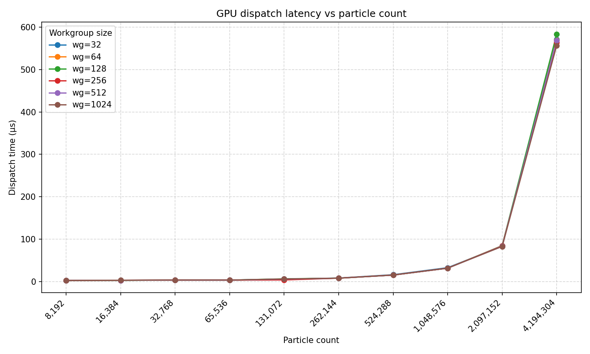
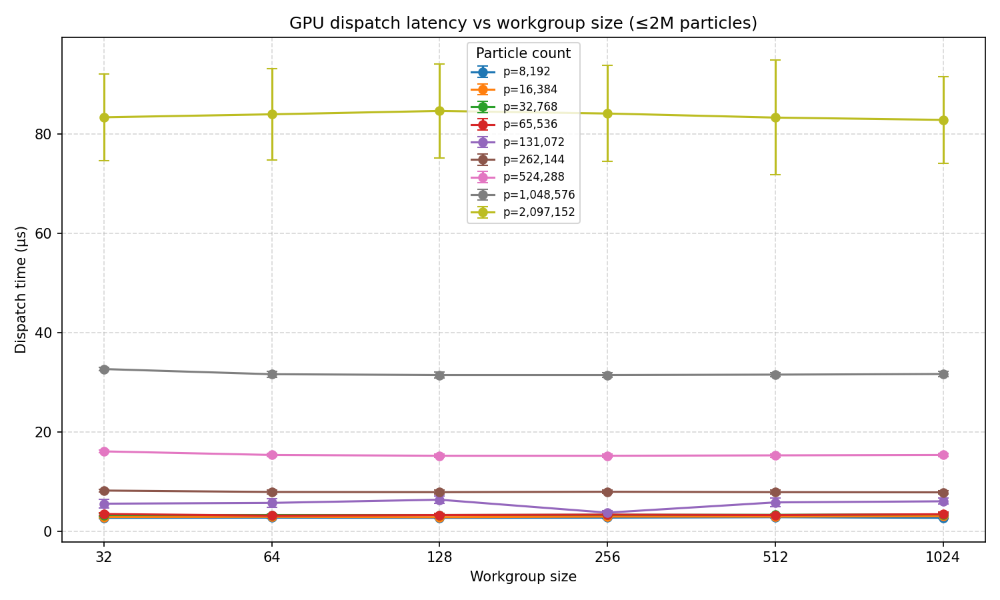
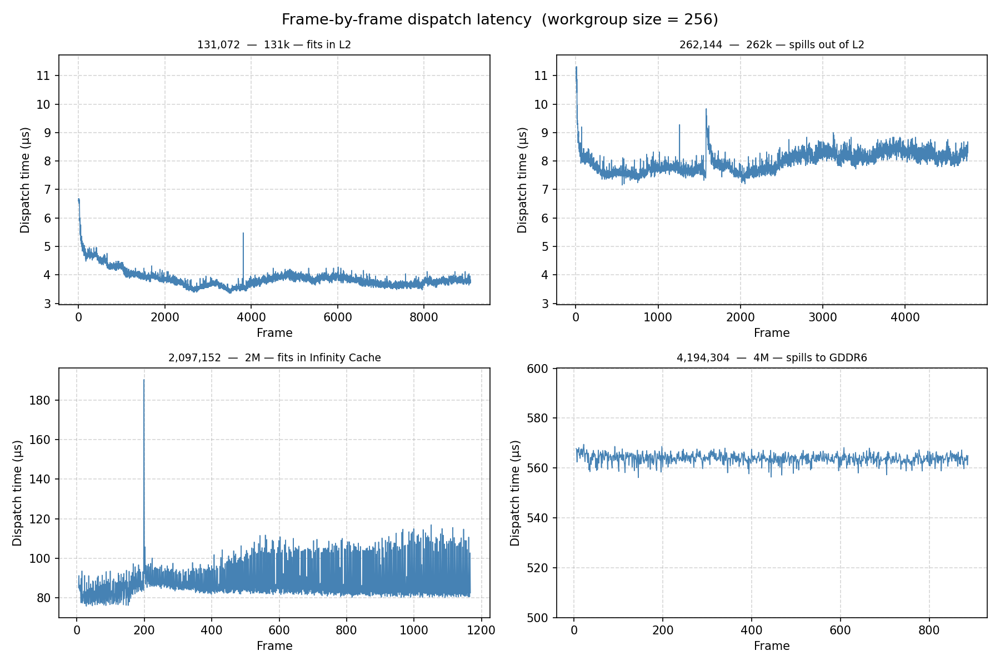
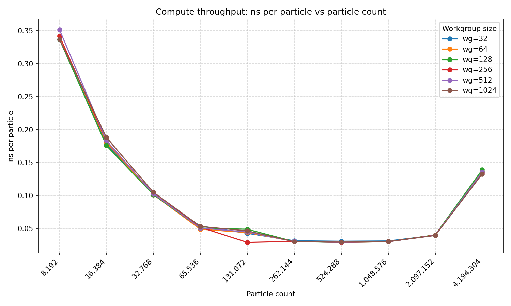

# Vulkan Compute Performance — RDNA3 Workgroup Sweep

<p align="center">
  
</p>

A Vulkan compute dispatch that updates millions of GPU-resident particles per frame, instrumented with GPU-side timestamp queries to measure actual shader execution time. The shader is intentionally minimal: one thread per particle and no inter-thread communication. A controlled memory bandwidth probe.

The automated sweep covers workgroup sizes from 32 to 1024 threads and particle counts from 8k to 4M+. At ~500k particles the measured dispatch time is ~17µs against a theoretical Infinity Cache ceiling of ~5.8µs. At 4M particles the cache overflows into GDDR6 and the cliff is visible in the data. 

Per-thread memory traffic (16B read + 16B write) was confirmed by inspecting the 
compiled GPU machine instructions produced by Mesa's RADV driver.

---

<details>
<summary><strong>What the application does</strong></summary>

The simulation places particles in a circle, assigns each one a velocity, and bounces them off screen edges. Every frame, a compute shader updates all particle positions on the GPU. A separate graphics pipeline renders them as coloured point sprites.

The compute shader is deliberately minimal:

```
new_position = old_position + velocity * deltaTime
```

One thread computes one particle. There is no inter-thread communication, no shared memory use, and minimal arithmetic. **This makes it a near-pure memory bandwidth test**.

The initial particle buffer is allocated in device-local GPU memory. The CPU uploads initial positions once via a staging buffer, than all updates happen entirely on the GPU with compute shader.

</details>

---

## Hardware baseline and theoretical expectations

<details>
<summary>RX 7900 XT — RDNA3 (gfx1100), 6 MiB L2, 80 MiB Infinity Cache, 800 GB/s GDDR6</summary>

https://rocm.docs.amd.com/en/docs-6.3.3/reference/gpu-arch-specs.html

| Property | Value |
|---|---|
| GPU | AMD Radeon RX 7900 XT |
| Architecture | RDNA3 (gfx1100) |
| Compute Units | 84 |
| Wavefront size | 32 threads |
| LDS per WGP | 128 KiB |
| Infinity Cache | 80 MiB |
| L2 Cache | 6 MiB |
| Graphics L1 Cache | 256 KiB |
| L0 Vector Cache | 32 KiB (per CU) |
| GDDR6 bandwidth | up to 800 GB/s |
| Effective bandwidth (with Infinity Cache) | up to 2900 GB/s |
| VRAM | 20 GB |

</details>

### Memory traffic per dispatch

Each particle holds:

| Field | Type | Size |
|---|---|---|
| position | float2 | 8 bytes |
| velocity | float2 | 8 bytes |
| color | float4 | 16 bytes |
| Total | | 32 bytes |

The compute shader reads position and velocity (16 bytes) and writes them back (16 bytes) —
**32 bytes of memory traffic per particle per frame**.

<details>
<summary>Total traffic per particle count calculations</summary>

To calculate the theoretical maximum speeds, I calculate the amount of bytes in power of 2. The particle count steps are purposely in power of 2, to get the traffic, multiply with 2^5 for the 32 byte traffic:

| Particle count | Total traffic per frame [bytes] |
|---|---|
| 65,536 | 2^16 * 2^5 = 2^21 = 2,097,152 |
| 131,072 | 2^17 * 2^5 = 2^22 = 4,194,304 |
| 262,144 | 2^18 * 2^5 = 2^23 = 8,388,608 |
| 524,288 | 2^19 * 2^5 = 2^24 = 16,777,216 |
| 1,048,576 | 2^20 * 2^5 = 2^25 = 33,554,432 |
| 2,097,152 | 2^21 * 2^5 = 2^26 = 67,108,864 |
| 4,194,304 | 2^22 * 2^5 = 2^27 = 134,217,728 |

</details>

### L2 / Infinity Cache and the expected bandwidth

The L2 cache is 6 MiB = 6,291,456 bytes. Therefore ~260k particles should show some speed degradation as L2 cache can't hold the entire memory traffic.

The Infinity Cache is 80 MiB = 83,886,080 bytes. It is unclear based on my quick research if this is just read or read and write.
Log2(80MiB) = Log2(83,886,080) = 26.32 so the cache can fit more than 2^26 bytes and less than 2^27 bytes.
This means around 2 Million particles should fit in the Infinity Cache, and we should not see significant drop in speed.
However it is still unclear if this is a read-only cache or read and write cache, for example 40MiB for read and 40MiB for write.
Therefore I cannot assume that the read+write whole traffic would fit in this cache, and memory latency could be mostly hidden with interleaving threads — or with more precise GPU terms, "high occupancy".

### Theoretical throughput ceiling

<details>
<summary>Calculations</summary>

Cache and GDDR6 speeds are given in GB for marketing instead of power of 2 speeds, for easier calculation, first change them to GiB/s:

2900 * (10^9 / 2^30) = 2700

2900 GB/s is 2700 GiB/s

800 GB/s is 745 GiB/s

Lets calculate the ~500k particles expected maximum speed at 2700 GiB/s:

2^24 / 2700 * 2^30 = 1/(2700) * 1/(2^(30-24)) = 1/(2700) * 1/(2^6) = 5.78 µs

Similarly let's see ~4M particles at GDDR6 speed without cache at all so at 745 GiB/s:

1/(745) * 1/(2^3) = 1 / 5960 = 167 µs

</details>

| Scenario | Theoretical ceiling |
|---|---|
| ~500k particles (Infinity Cache, 2700 GiB/s) | **5.78 µs** |
| ~4M particles (GDDR6 only, 745 GiB/s) | **167 µs** |


### Workgroup size

<details>
<summary>Baseline dispatch</summary>

The original tutorial uses:
`commandBuffer.dispatch(PARTICLE_COUNT / 256, 1, 1);`

The compute shader declares:
```
[shader("compute")]
[numthreads(256,1,1)]
```

Each work group runs 256 threads. To cover all particles with one thread per particle,
the number of workgroups = particle count / threads per workgroup.

</details>

The Vulkan API controls workgroup count via the dispatch call, and the shader defines thread count per workgroup.

```
GPU
└── Shader Engine (SE)
    └── Work Group Processor (WGP)
        └── CU × 2  (a WGP contains 2 CUs)
            └── SIMD × 4  (each CU has 4 SIMDs)
                └── 16 wavefront slots  (each SIMD can hold 16 waves)
```

On RDNA3 each wavefront is 32 threads wide. A workgroup size that is not a multiple
of 32 leaves the last wavefront partially empty, wasting SIMD lanes. The sweep tests
32, 64, 128, 256, 512, and 1024 threads per workgroup — all exact multiples of 32.

Threads within a workgroup share LDS (Local Data Share, 128 KiB). If a workgroup
uses large amounts of LDS, fewer workgroups fit on a WGP simultaneously, reducing
occupancy.

Smaller workgroups allow freer wavefront scheduling, but at large particle counts
the higher workgroup count may introduce GPU bookkeeping overhead. Since this shader
uses no LDS and has no inter-thread dependencies, neither effect is expected to
dominate — measurements shall decide.


<details>
<summary><strong>Measurement methodology</strong></summary>

### Why not CPU timing?

Wrapping a `vkQueueSubmit` call in `std::chrono` on the CPU measures the wrong thing. The CPU call returns almost immediately — the GPU executes the work asynchronously. Even if you wait for the fence, you are measuring submission overhead, driver processing, fence signalling, and OS scheduling jitter on top of the actual GPU execution time.

### Vulkan timestamp queries

This project uses `VK_QUERY_TYPE_TIMESTAMP` to record GPU-side timing:

1. `vkCreateQueryPool` — creates a pool with 2 slots (start and end)
2. `vkCmdResetQueryPool` — resets slots inside the command buffer before use
3. `vkCmdWriteTimestamp` with `VK_PIPELINE_STAGE_COMPUTE_SHADER_BIT` — written immediately before the dispatch
4. `vkCmdWriteTimestamp` again — written immediately after the dispatch
5. After the frame fence signals, `vkGetQueryPoolResults` retrieves the two tick values
6. Elapsed time in nanoseconds = `(ticks[1] - ticks[0]) × timestampPeriod`

`timestampPeriod` is retrieved from `VkPhysicalDeviceProperties` and converts GPU clock ticks to nanoseconds. The result is the actual GPU execution time of the dispatch, isolated from everything else.

### Automation

A `--duration <seconds>` CLI argument closes the window after a fixed run time, 
enabling a shell script to sweep all particle count and workgroup size combinations 
unattended. Results are written to CSV and plotted with a Python script in `scripts/`.

</details>

## Results

Dispatch time grows non-linearly with particle count. All six workgroup sizes overlap 
almost exactly, confirming the bottleneck is memory bandwidth rather than anything 
workgroup-specific. The curve stays flat through the Infinity Cache range, then rises 
steeply at 2M and sharply again at 4M as data spills to GDDR6.


Across all particle counts, changing workgroup size from 32 to 1024 produces no 
meaningful difference in dispatch time. This confirms the bandwidth-bound hypothesis 
from the hardware section. When the bottleneck is memory throughput, thread grouping 
does not matter. The 2M line shows notably large variance (visible error bars), which 
is examined in the next graph.


Frame-by-frame dispatch time at four particle counts that each represent a different 
cache regime. At 131k the GPU visibly warms up: dispatch time starts at ~6.5µs and 
settles to ~4µs over the first ~500 frames as GPU clocks ramp up. 

At 262k (spilling out of L2) times stabilise around 8µs with occasional spikes, but the L2 spill itself 
causes no dramatic step change. The GPU hides the latency with high occupancy. 

At 2M (nominally inside Infinity Cache) times are noisy and drifting, ranging 80–110µs, 
the Infinity Cache is operating near its capacity boundary, producing irregular access 
patterns. 

At 4M (spilled to GDDR6) times are strikingly stable at ~565µs GDDR6 
saturates predictably, giving consistent throughput with minimal variance.



Normalising by particle count reveals dispatch overhead at small sizes. At 8k and 
16k the fixed cost of launching a dispatch dominates, giving high ns/particle values. 
From ~65k onwards the curve flattens to around 0.03 ns/particle, where the GPU is 
fully utilised and the per-particle cost is stable. At 4M the Infinity Cache overflow 
is clearly visible as a sharp uptick. The same work costs ~4–5× more per particle 
due to GDDR6 latency.



### Compiler investigation 

The theoretical ceiling for ~500k particles is 5.78µs, the measured result is ~17µs —
roughly a 3× gap. Theoretical ceilings assume perfect bandwidth saturation with zero
scheduling overhead and no cache warmup. The gap is expected. The more interesting
question is whether the 32 bytes per particle bandwidth model is actually correct, or
whether the shader was silently doing more memory work than assumed.

The shader only reads and writes position and velocity, it never touches the color
field. But the Particles struct contains color (16 bytes), raising the question of
whether the compiler loads the full struct anyway. 

Inspecting the SPIR-V intermediate representation:
```
spirv-dis /vulkan-compute-perf/build/shaders/slang.spv 2>/dev/null | awk '/^.*%compMain = OpFunction/,/^.*OpFunctionEnd/' | head -120
```


Showed an `OpLoad` of the entire struct:
```
%78 = OpLoad %ParticleSSBO_std430 %77
```
which suggested a possible 32B read + 16B write rather than the assumed 16B + 16B.

To get a definitive answer, the full compiled GPU machine instructions were extracted
from Mesa's RADV driver:

```
RADV_DEBUG=shaders ./VulkanComputePerf 2>isa_dump.txt
```

The relevant instructions:
```
buffer_load_b128 v[4:7], v0, s[12:15], 0 offen
buffer_store_b128 v[4:7], v0, s[4:7], 0 offen
```

128-bit load and 128-bit store. Exactly 16 bytes read and 16 bytes written. The
driver's compiler backend eliminated the color field entirely despite the SPIR-V
intermediate representation suggesting a full struct load. The bandwidth model is
correct.

Additionally, the delta time uniform is routed to the scalar cache rather than the
vector cache:
```
s_buffer_load_b32 s1, s[8:11], null
```

This is correct behaviour: a value uniform across all threads belongs in the scalar
cache, freeing vector cache bandwidth for the per-particle data.

The ~3× gap from the theoretical ceiling is therefore not a measurement error or a
compiler inefficiency. It reflects realistic bandwidth utilisation: launch overhead,
cache warmup (visible in the 131k frame-by-frame graph), and the fact that peak
advertised bandwidth is rarely achievable in practice.

<details>
<summary><strong>Code notes</strong></summary>

### Fragile descriptor binding in order of declaration 
The integer passed to vk::DescriptorSetLayoutBinding(N, ...) on the CPU side must exactly match `[[vk::binding(N)]]` in the shader. There is no compiler enforcement of this correspondence in the used tutorial example. A mismatch produces silent corruption or a validation layer warning rather than a build error.

Slang will assign bindings implicitly by declaration order when `[[vk::binding(N)]]` is omitted, which is fragile — reordering declarations silently shifts all binding numbers.

Possible mitigations

Explicit annotations:  Quickest sollution is used here, declare `[[vk::binding(N)]]` on every resource in shader file (.slang).
SPIRV-Reflect: introspect the compiled SPIR-V binary at runtime to auto-discover binding layout, driving descriptor set creation from the shader itself rather than hardcoded constants.
Bindless / descriptor indexing: a modern Vulkan pattern that replaces per-binding wiring with a large descriptor array and runtime indices, sidestepping the problem at a design level.

</details>


<details>
<summary><strong>Building</strong></summary>

Requires Vulkan SDK, GLFW, GLM, and CMake.
workgroup size (default: 256) must divide PARTICLE_COUNT (default:8192) without remainder
Maximum workgroup size is 1024 by hadrware limitation
```bash
cmake -B build -S .
cmake --build build
cd build
./VulkanComputePerf --particle-count 32768 --workgroup-size 64 --duration 10
```

</details>

## Credits

Vulkan code largely based on [https://docs.vulkan.org/tutorial/](https://docs.vulkan.org/tutorial/latest/11_Compute_Shader.html) by Alexander Overvoorde, licensed under CC BY-SA 4.0.